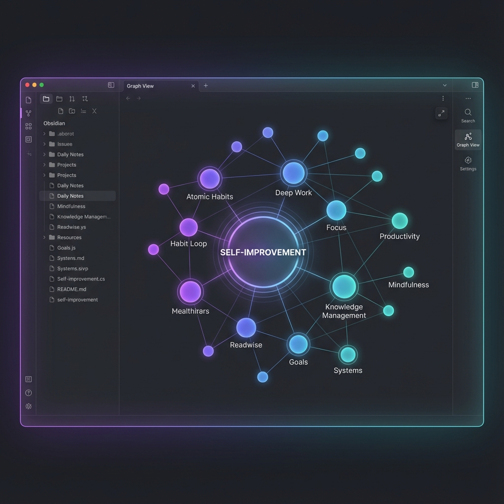
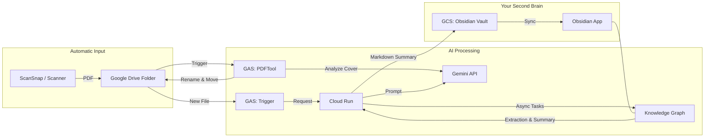

# Book Summary System: PDF to Knowledge Graph 🧠

**自炊本のスキャン、要約の自動化、そして知識の可視化。**



このシステムは、スキャンしたPDFライブラリを、相互に繋がった生きたナレッジベースへと進化させます。ファイルの整理や洞察の抽出といった退屈な作業を自動化し、[Obsidian](https://obsidian.md) を使った「アイデアの結合」に集中できる環境を提供します。

## なぜこのシステムを使うのか？

- **📚 処理の自動化**: GoogleドライブにPDFを置くだけで、リネーム、カテゴリ分け、メタデータ抽出、要約が自動で行われます。
- **🕸️ ナレッジグラフ**: 単なるフォルダ分けとは異なり、異なる書籍やWebクリップ間で重要な概念を繋ぎ合わせます。ある本の「生産性」というトピックが、別の本の「集中力」とどう関連しているかを可視化できます。
- **🤖 AIによる解析**: Gemini 2.0 Flash/Visionを使用し、目次構造の抽出や、コンテキストを考慮した高品質な要約を生成します。
- **⚡ 手間いらず**: Google Apps ScriptとCloud Functionsを利用し、すべてバックグラウンドで動作します。

## システムの仕組み



## ワークフロー

### 1. スキャンから要約まで（全自動）
1. **Scan**: ScanSnapなどのスキャナーで、Googleドライブの「ScanRaw」フォルダに本をスキャンします。
2. **Organize**: システムが起動（毎日）し、表紙を解析して著者名とタイトルを特定、適切なジャンルフォルダ（例：`Business/著者_タイトル.pdf`）に移動・リネームします。
3. **Summarize**: 整理された新しいPDFを検知し、目次を読み取って各章ごとの構造化された要約を生成します。
4. **Sync**: 要約はMarkdownファイルとしてObsidian Vaultに保存されます。

### 2. 知識の発見
- Obsidianを開くと、新しい書籍の要約が届いています。
- 本の中で見つかった重要な**キーコンセプト**が自動的にリンクされます。
- **グラフビュー**を探索して、その本が過去に保存した他の本やWebクリップとどう繋がっているかを確認できます。

## ディレクトリ構成

```
BookSummarySystem/
├── cloud_function/        # Cloud Run サービス (Python)
│   ├── main.py           # エントリポイント / ルーター
│   ├── services/         # Gemini, GCS, PDF処理等のコアロジック
│   ├── tasks/            # Cloud Tasks 用のワーカー (章要約, 統合処理)
│   └── Procfile          # Cloud Run の起動定義
├── gas/                   # Google Apps Script層 (トリガーとドライブ管理)
│   ├── PDFTool.gs        # PDFの処理と自動整理
│   ├── Trigger.gs        # ワークフロー全体の制御
│   ├── ConfigService.gs  # GCS設定ローダー
│   └── AlertService.gs   # エラー通知サービス
├── config/                # 統一設定
│   └── system_config.json # GCS設定ファイル
└── docs/                  # ドキュメント・アセット
    ├── ARCHITECTURE.md    # システム全体構成
    ├── PDF_PROCESSING_FLOW.md  # PDF処理の分岐ロジック
    ├── TOC_EXTRACTION.md  # 目次抽出ロジック
    ├── CONFIG.md          # 設定管理ガイド
    └── MONITORING.md      # 監視・アラートガイド
```

## 監視とアラート

システムは包括的な監視機能を備えています：

- **📊 Structured Logging**: Cloud Logging へのジョブ追跡ログ
- **📈 Job Status Tracking**: GCS上でリアルタイムにステータス確認
- **📧 Email Alerts**: エラー発生時の自動通知
- **🔍 Log Queries**: ジョブIDやステージ別のログ検索

詳細は **[MONITORING.md](./docs/MONITORING.md)** を参照してください。

## 設定管理

設定は GCS 上の `config/system_config.json` で一元管理されます。これにより:

- Cloud Function と GAS で設定を共有
- 再デプロイなしで設定変更が可能
- 環境変数をフォールバックとして保持

詳細は **[CONFIG.md](./docs/CONFIG.md)** を参照してください。

## 技術ドキュメント

処理ロジックの詳細は以下を参照してください:：

| ドキュメント | 内容 |
| :--- | :--- |
| [ARCHITECTURE.md](./docs/ARCHITECTURE.md) | システム全体の構成とコンポーネント一覧 |
| [PDF_PROCESSING_FLOW.md](./docs/PDF_PROCESSING_FLOW.md) | PDFTool.gsの分類・結合・振り分けロジック |
| [TOC_EXTRACTION.md](./docs/TOC_EXTRACTION.md) | Vision AI / 正規表現による目次抽出フロー |
| [CONFIG.md](./docs/CONFIG.md) | 設定管理ガイド (GCS統一設定) |
| [MONITORING.md](./docs/MONITORING.md) | 監視・アラート・ログ管理ガイド |

## セットアップとデプロイ

> [!IMPORTANT]
> 本システムの利用には、課金が有効なGoogle Cloud Platform (GCP) プロジェクトが必要です（Gemini APIおよびCloud Functionsの利用のため）。

詳細なインストール手順については、**[DEPLOY.md](./DEPLOY.md)**を参照してください。

### クイックスタート概要
1. **Deploy Cloud Function**: AI処理を担うプロセッサのデプロイ
2. **Setup Google Apps Script**: ドライブからのワークフローを制御するGASの設定
3. **Configure Settings**: **スクリプトプロパティ**を使用して、フォルダIDやAPIキーを安全に設定します（コード内へのハードコードは不要です！）。

## 設定項目

すべての設定は、**Google Apps Script のスクリプトプロパティ**で安全に管理されます。

| プロパティ | 説明 |
| :--- | :--- |
| `GCS_BUCKET` | 設定と一時保存用 GCS バケット |
| `CLOUD_FUNCTION_URL` | デプロイした Cloud Function の URL |
| `GEMINI_API_KEY` | Gemini API キー |
| `SOURCE_FOLDERS` | 監視対象フォルダのマップ (JSON形式) |
| `PDF_DESTINATION_FOLDERS` | 振り分け先フォルダのマップ (JSON形式) |

---
*知的なナレッジ管理を愛するすべての人のために。*
