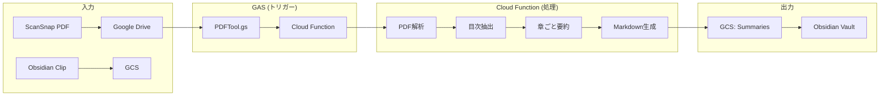

# BookSummarySystem アーキテクチャ

このドキュメントは、BookSummarySystemの全体構成と各コンポーネントの役割を説明します。

## システム概要

## コンポーネント一覧

| コンポーネント | 場所 | 役割 |
|:---|:---|:---|
| **PDFTool.gs** | `gas/PDFTool.gs` | スキャンPDFの結合・リネーム・フォルダ振り分け |
| **Trigger.gs** | `gas/Trigger.gs` | Cloud Function呼び出しトリガー |
| **ClipProcessor.gs** | `gas/ClipProcessor.gs` | Obsidianクリップの処理 |
| **ConfigService.gs** | `gas/ConfigService.gs` | GCS設定ローダー |
| **AlertService.gs** | `gas/AlertService.gs` | エラー通知サービス |
| **GcsStorage.gs** | `gas/GcsStorage.gs` | GCS操作・同期 |
| **RefactorJob.gs** | `gas/RefactorJob.gs` | 概念リファクタリングジョブ |
| **Cloud Function** | `cloud_function/` | PDF解析・要約生成のメイン処理 |
| **pdf_processor.py** | `cloud_function/services/` | 目次抽出・チャプター分割ロジック |

## 処理フロー詳細

各処理フローの詳細は以下のドキュメントを参照してください：

- [PDF処理フロー](./PDF_PROCESSING_FLOW.md) - PDFTool.gsの分岐ロジック
- [目次抽出ロジック](./TOC_EXTRACTION.md) - Cloud Functionでの目次抽出処理
