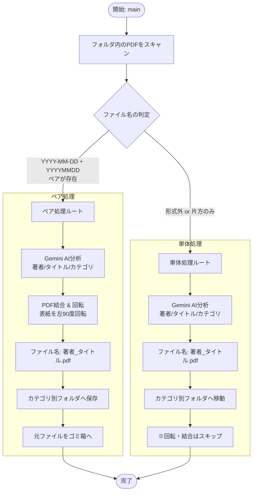

# PDF処理フロー (PDFTool.gs)

このドキュメントでは、`gas/PDFTool.gs` におけるPDFファイルの分類・処理ロジックを説明します。

## 概要

PDFToolは、ScanSnapなどでスキャンされたPDFを自動的に処理するGoogle Apps Scriptです。
- 表紙と本紙をペアリングして結合
- Gemini AIで内容を解析し、適切なファイル名とフォルダに振り分け

## 処理フロー図



## ファイル名の判定ルール

| パターン | 例 | 分類 |
|:---|:---|:---|
| `YYYY-MM-DD.pdf` | `2024-01-15.pdf` | 表紙 (Cover) |
| `YYYYMMDD.pdf` | `20240115.pdf` | 本紙 (Main) |
| `YYYY-MM-DD_xxx.pdf` | `2024-01-15_test.pdf` | 表紙 (サフィックス付き) |
| `YYYYMMDD_xxx.pdf` | `20240115_test.pdf` | 本紙 (サフィックス付き) |
| その他 | `Document.pdf` | 単体 (Standalone) |

## ペアリング条件

1. **日付部分の一致**: `YYYY-MM-DD` と `YYYYMMDD` で日付が同一
2. **サフィックスの一致**: `_xxx` 部分も一致する必要あり
3. **両方揃っている**: 表紙のみ or 本紙のみの場合は「単体」扱い

## Gemini AI分析

Geminiは以下の情報を抽出します：

```json
{
  "author": "著者名",
  "title": "タイトル",
  "volume": "01",
  "category": "Manga | Novel | Humanities/Business | Technical | Other"
}
```

## カテゴリ別フォルダ振り分け

`PDF_DESTINATION_FOLDERS` プロパティに設定されたマッピングに基づき、自動振り分けを行います。

```javascript
{
  "Manga": "1abc...",
  "Novel": "2def...",
  "Humanities/Business": "3ghi...",
  "Technical": "4jkl...",
  "Other": "5mno..."
}
```

## 設定項目

| プロパティ名 | 説明 |
|:---|:---|
| `PDF_SCAN_RAW_FOLDER_ID` | スキャン対象フォルダID |
| `PDF_FALLBACK_FOLDER_ID` | AI分析失敗時のデフォルト保存先 |
| `PDF_DESTINATION_FOLDERS` | カテゴリ別フォルダマッピング (JSON) |
| `GEMINI_API_KEY` | Gemini APIキー |
