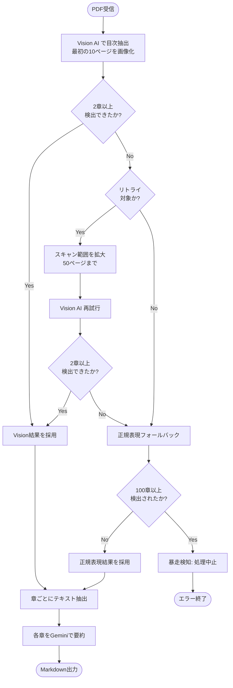

# 目次抽出ロジック (TOC Extraction)

このドキュメントでは、Cloud Function (`pdf_processor.py`) における目次抽出の判断ロジックを説明します。

## 概要

書籍PDFから章構成を抽出するために、以下の2つのアプローチを併用しています：

1. **Vision AI (Gemini)**: 目次ページの画像解析
2. **正規表現**: 本文テキストからのパターンマッチング

## 処理フロー図



## Vision AI 目次抽出

### 設定値

| 設定 | 値 | 説明 |
|:---|:---|:---|
| `TOC_EXTRACTION_MODEL` | `gemini-2.5-flash` | 使用するGeminiモデル |
| `TOC_IMAGE_DPI` | `100` | 画像変換時のDPI |
| `TOC_SCAN_START_PAGE` | `3` | スキャン開始ページ (0-indexed) |
| `TOC_SCAN_END_PAGE` | `30` | スキャン終了ページ |

### プロンプト概要

Geminiに送信するプロンプトでは以下を指示：
- 目次ページを探す
- 「第○部」「第○章」「Chapter X」などの見出しを検出
- 各章のタイトルと開始ページ番号を抽出
- JSON形式で出力

### 出力例

```json
{
  "volume_info": "全1巻",
  "has_toc_page": true,
  "chapters_in_this_volume": [
    {"number": "第1部", "title": "基礎理論", "content_start_page": 15},
    {"number": "第2部", "title": "応用編", "content_start_page": 120}
  ]
}
```

## 正規表現フォールバック

Vision AIが失敗した場合、テキストベースの正規表現で章を検出します。

### 検出パターン

```regex
# Primary Pattern
(?:^|[\n\r]+)\s*(?:第\s*([0-9０-９一二三四五六七八九十百壱弐参]+)\s*[部章編節]|(?:Chapter|CHAPTER|Part|PART|パート)\s*([0-9０-９IVXivx]+))

# Fallback Pattern (緩い)
第\s*[0-9０-９一二三四五六七八九十壱弐参]+\s*[部章]
```

### 対応形式

- `第1章`, `第一章`, `第壱章`
- `第1部`, `第一部`
- `Chapter 1`, `CHAPTER 1`
- `Part 1`, `PART I`

## 暴走検知

正規表現で100章以上検出された場合、OCRノイズによる誤検出と判断し処理を中止します。

```python
if len(chapters) > 100:
    raise RuntimeError("Runaway detection: Too many chapters")
```

## リトライロジック

Vision AIで2章未満しか検出できなかった場合：
1. スキャン範囲を50ページまで拡大
2. 再度Vision AIを実行
3. それでも失敗したら正規表現フォールバック

## エラーログ

抽出エラーはGCSの `jobs/{job_id}/errors.json` に保存されます。

```json
{
  "toc_extraction": {
    "stage": "validation",
    "warning": "Vision TOC extracted only 1 chapter(s)",
    "extracted_chapters": 1
  }
}
```
